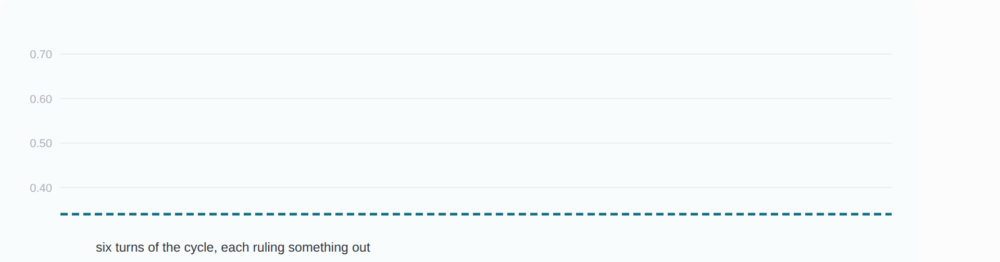

# Exploration

Where the loop has been between releases, and what each direction turned out to
hold. Releases themselves are in [`versions/`](versions/); this is the territory
around them.

The agent transcripts, proposals and queues stay private — publishing them would
let a reader re-run our search instead of checking our result. The arms and their
numbers are here in full.

## jevtr_v1 — the first multi-agent exploration of training (2026-09-23/24)

Three analyst agents, six GPU agents, a monitor and an orchestrator, sent out along
the model, data and training axes from v1.0's recipe. **24 directions explored. None
came back with a keeper — and that is the finding.**

The bar was fixed in advance: better than **+0.020** on the 3-seed mean, all seeds
stable, MMLU-Pro within 0.020, same kernel stack. Champion 0.6622.

  

| axis | arms | best | what it was |
|---|---|---|---|
| training | 10 | **+0.0035** | keep-last-k 100 — not confirmed at three more seeds (6-seed mean 0.6626) |
| model | 5 | **+0.0008** | option-marker capacity control |
| data | 8 | **−0.0015** | entropy filter, keep below 0.5 |
| control | 2 | +0.0003 | champion rerun, which is the noise floor |

Four arms came out above the champion and none by enough to mean anything: +0.0035,
+0.0013, +0.0010, +0.0008, against a per-seed sd of 0.011–0.016. One arm failed on
infrastructure — another session deployed into the live evaluator tree — and was
rerun. Three data arms used teacher labels read by a biased first-token readout, so
they do not test the axis they were aimed at.

### What the territory turned out to be like

- **The benchmark's teacher is unsure about most of it.** 61% of test items have a
  gold max-probability below 0.67, and they carry 75% of the errors. On those the
  champion already beats the teacher's own mass, so there is little left to win.
  Matching the teacher where it *is* confident is worth about +0.024.
- **The model fits the wrong teacher well.** 0.850 on held-out synth against 0.662
  on the benchmark. More capacity and more synth fit both transferred worse.
- **The bar was above the resolution.** A difference of two 3-seed means has an sd
  of about 0.010, so a realistic single-axis effect of +0.005 is invisible against a
  +0.020 threshold. The run was not powered to find what it was looking for.
- **What has ever worked here was capability, not fit** — fine-tuning the tower
  (+0.13) and 0.8B to 2B (+0.048). The readout head is interchangeable.

That last point is the run's most useful output, and it is a negative: eight data
arms and ten training arms moved nothing, which says the next release has to change
what the model *can do*, not how it is fitted.

### What comes back with us

- **RL is stable on this base** at last (arm 24): learning rate ×0.2, KL β 0.5 to
  the SFT snapshot, and a hard KL gate. It still needs a reward carrying information
  the SFT target does not.
- **A reasoning teacher is worth distilling.** Zero-shot Qwen3.5-4B with a
  1,024-token thinking budget scores 0.677 on the test split and 0.964 where its own
  labels are confident. It cannot serve — Jev is System One and generates nothing —
  but it can label or reward at training time.
- **Order averaging at inference is null**: +0.001, canonical plus reversed.
- **Tooling that outlived the run:** a confident-item metric, a stricter stability
  rule, a frozen worker tree, an orphan watchdog, and an append-only result log.

### What it cost

The infrastructure failure above is worth naming, because it was ours: a deploy into
the tree the evaluator was reading cost the run three seeds and one arm. Agents run
against frozen snapshots from arm 10 onward for that reason.

## jevtr_v1, continued — from v1.0 to v2.0 (2026-09-24/26)

The same loop with a revised protocol (four seeds per arm, a diagnostic step, and a
portfolio that must include regime-level bets), later with a 12-benchmark evaluation
suite. **About 50 more arms; two lasting wins, both about data.** v2.0 is built from
them.

Three things changed during this stretch, all at the run owner's direction, and they
shape how to read the numbers:

- **The benchmark's train split became allowed.** v1.0 never saw any
  `LocalLLaMA/typed-decisions` data. From here on, training may use the *train* split of
  any benchmark; *test* splits never, checked by the arm runner. v2.0's scores on those
  benchmarks are therefore **not zero-shot**, unlike v1.0's.
- **One benchmark became twelve.** typed-decisions test, Nimble (public and holdout), MMLU-Pro
  1k, the Jev-Style panel, Kev transfer, hard, documents and devtools, JevBench, a
  procedural set and Open-Jev OOD, frozen and decontaminated. The headline became the
  weighted suite mean, and the KEEP bar was recalibrated to the suite's own noise
  (+0.006, confirmed on four fresh seeds).
- **Three more benchmarks were set aside and never looked at** until release, so the
  release numbers carry no selection bias from dozens of KEEP decisions: tasksource,
  SemIf external and scienthoon OOD.

The bar was fixed in advance and recalibrated once, when the suite replaced the single
benchmark: better than **+0.006** on the four-seed suite mean, no benchmark regressed
beyond its own seed noise, MMLU-Pro within 0.030, all seeds stable, same kernel stack,
then repeated on four fresh seeds against a baseline run on those same seeds.

| axis | arms | best | what it was |
|---|---|---|---|
| data | 23 | **+0.072** | the other benchmarks' train splits, 3k cases per source — this became v2.0 |
| calibration | 8 | **ECE −0.041** | an out-of-fold confidence head; the shipped variant gives back 0.010 of that to keep its score answers faithful to the teacher |
| training | 5 | +0.0003 | an order-consistency penalty — inside the noise, like the ten before it |
| tooling | 8 | — | the 12-benchmark suite, a 2.48M-question inventory, the adaptive generator |
| control | 5 | +0.0010 | the champion repeated on fresh seeds, which is the noise floor |

Eight of the 49 were tooling that produced no number of its own, and five were controls.
Of the 36 that were judged, **four were kept**: the benchmark's own train split with
general-knowledge replay, the other benchmarks' train splits, and two forms of the
confidence head. None of the five training arms was kept, and no
reinforcement-learning arm has been kept anywhere in this run.

### What worked

| what | effect | notes |
|---|---|---|
| **Train on a benchmark's own train split** | typed-decisions 0.662 → **0.797** | general-knowledge multiple-choice replay at 15% keeps MMLU-Pro within its guard |
| **The same, for the other benchmarks' train splits** (capped at 3k cases each) | suite mean 0.633 → **0.705**, every seed up, confirmed on fresh seeds | Kev hard +0.30, Nimble holdout +0.19, Kev documents +0.15; MMLU-Pro −0.027 |
| **An out-of-fold confidence head** for calibration | suite ECE 0.105 → **0.055–0.074** | one forward pass, answers unchanged; fixes over- *and* under-confidence, which a single temperature cannot |
| Generated data shaped like the test profile | +0.003 to +0.009 on the suite mean | real gains on out-of-distribution benchmarks, but they overlap each other, and they add nothing on top of the train splits |

### What did not work

| what | result | why, as far as we can tell |
|---|---|---|
| **Distilling a reasoning teacher** (Qwen3.5-4B, thinking), four ways: mixed labels, pure labels, targeted swaps, RL reward | −0.007 to −0.016 | the teacher is better at the task (0.677 zero-shot) but disagrees with the benchmark's own teacher exactly on the ambiguous items, and that is where its labels move the student |
| **RL on the decision itself**: reward = SFT target, reasoning-teacher agreement, exact accuracy + Brier, order consistency, calibration (RLCR) | −0.007 to +0.000; calibration RL moved ECE by only 0.009 | a one-pass decision model with a known answer for every option is a one-step, full-information bandit; RL either reproduces the supervised optimum or, KL-anchored, cannot move far enough. We found no published result showing RL beating SFT on the same labels for this setting |
| **A bandit over the data mix** | −0.006 | small slices got outsized credit, and it optimised its own probes while test fell. It lives on as the policy of the data generator, with those fixes |
| **More public data in bulk** (a 2.48M-question pool, filtered) | 50k: −0.017; 200k: −0.024, MMLU-Pro −0.09 | hundreds of thousands of one-hot classification rows erode general knowledge and inflate confidence |
| **Stacking the generated corpora** | +0.0015 | their gains overlap; MMLU-Pro falls as more is added |
| **More replay to protect MMLU-Pro** in the v2.0 recipe | no better | 15% and 30% replay did not lift MMLU-Pro; a science-weighted 10% helped slightly and is being confirmed |
| A single global temperature for calibration | ECE unchanged | the model was under-confident on typed-decisions and over-confident elsewhere; one number cancels out |

### What comes back with us

- **Data aimed at the model's weaknesses, not bulk data.** An adaptive generator
  (Azure GPT-5.x and self-hosted models, with a gpt-6-class model only for hard cases)
  now profiles the current model on dev probes, writes cases for its weakest cells, and
  checks them for grounding and triviality. On v1.0's base it helped; on v2.0's base
  the train splits already cover what it taught, so its next rounds aim at what v2.0
  still gets wrong: wide label spaces, negation, dates.
- **RL has a job, just not on the decision head**: choosing what to generate next,
  rewarded by the student's measured progress. That head-to-head is the next experiment.
- **Near-misses are repaired, not dropped**: an arm that clears the bar but fails one
  guard gets a diagnosis and a targeted-data repair, instead of being discarded.

### Every arm, with its numbers

**Outcomes:** *kept* entered the champion line · *improved, not kept* beat the champion
by less than the bar, or failed a guard · *rejected* did neither · *noise* landed inside
the noise floor · *control* is a reference run, not a bet · *tool* produced no score of
its own.

Twenty-one arms were judged on typed-decisions pooled top-1, the v1.0 headline. The
suite was built partway through, and the twenty-eight after it were judged on the
weighted suite mean. The two groups are not comparable, so they are listed apart.

**Judged on typed-decisions top-1** · champion 0.6625, then 0.796 from `spec-2` onward

| arm | axis | outcome | typed-decisions | MMLU-Pro | suite ECE | what it was |
|---|---|---|---|---|---|---|
| `tool-1-validate-q35-4b-thinking-traces` | tool | tool | — | — | — | validated a reasoning teacher: 0.677 zero-shot, 0.964 where it is confident |
| `training-10-distill-reasonteacher-sft` | training | rejected | 0.6514 | 0.341 | — | supervised distillation from that teacher, mixed with the synth target |
| `data-14-trace-distill-pure-t3` | data | rejected | 0.6458 | 0.327 | — | the same, on the teacher's labels alone |
| `data-15-trace-surgical-correct` | data | rejected | 0.6482 | 0.331 | — | the same, only on items the champion got wrong |
| `training-9-rl-reasonteacher-reward` | training | rejected | 0.6552 | 0.349 | — | the teacher's agreement as an RL reward |
| `tool-2-collect-all-decision-data` | tool | tool | — | — | — | inventoried 2.48M public decision questions, 34 sources, licences recorded |
| `tool-4-generation-pipeline` | tool | tool | — | — | — | a writer/judge pipeline for new cases, with grounding checks |
| `spec-1-synth-plus-td-train` | data | rejected | 0.7794 | 0.332 | — | **first arm allowed the benchmark's train split**; MMLU-Pro paid for it |
| `spec-1-synth-plus-td-train-x3` | data | rejected | 0.7993 | 0.331 | — | the same, each case seen three times |
| `tool-3-filter-decision-pool` | tool | tool | — | — | — | filtered that pool to a usable corpus |
| `spec-2-x3-plus-mc-replay-r15` | data | **kept** | 0.796 | 0.346 | — | **+ 15% general-knowledge replay — the first keeper** |
| `gen-1-pool-v2-50k` | data | rejected | 0.6455 | 0.301 | — | 50k questions from the public pool |
| `spec-2-x3-plus-mc-replay-r30` | data | rejected | 0.7915 | 0.347 | — | 30% replay instead of 15% |
| `gen-2-pool-v2-200k` | data | rejected | 0.6384 | 0.265 | — | 200k from the pool; general knowledge fell hardest here |
| `spec-3-replay-dose-r05` | data | rejected | 0.7951 | 0.335 | — | 5% replay |
| `spec-3-replay-dose-r10` | data | improved, not kept | 0.7964 | 0.330 | — | 10% replay; 15% stayed the best dose |
| `tool-5-eval-suite` | tool | tool | — | — | — | **built the 12-benchmark suite**, frozen and decontaminated |
| `training-13-accbrier-exact-anchor` | training | rejected | 0.7908 | 0.341 | — | exact accuracy + Brier reward, KL-anchored |
| `training-12-orderconsist-specialist-w1` | training | improved, not kept | 0.7963 | 0.340 | — | penalise disagreement between option orders |
| `training-11-lp-bandit-slice-pilot` | training | rejected | 0.79 | 0.333 | — | a bandit re-weighting the existing data mix |
| `gen-data-1-teacher-select-and-10k` | tool | tool | — | — | — | teacher-selected generation, 10k cases |

**Judged on the 12-benchmark suite mean** · champion 0.6327

| arm | axis | outcome | suite mean | MMLU-Pro | suite ECE | what it was |
|---|---|---|---|---|---|---|
| `ctl-suite-best` | control | control | 0.6327 | 0.349 | — | the champion on the new suite — **the bar for everything below** |
| `ctl-suite-ref` | control | control | 0.609 | 0.351 | — | **the v1.0 recipe on the new suite** — the release-to-release reference |
| `tool-6-adaptive-generation-loop` | tool | tool | — | — | — | **the adaptive generator**: profile the model, write for its weak cells |
| `gen-arm-1-best-plus-testprofile` | data | improved, not kept | 0.6361 | 0.343 | — | generated data shaped like the test profile |
| `gen-arm-2-best-plus-refprior` | data | improved, not kept | 0.6376 | 0.344 | — | the same, with a reference-value prior |
| `suite-train-1-cap1k` | data | rejected | 0.6932 | 0.325 | — | **the other benchmarks' train splits**, 1k cases per source |
| `cal-2a-rlcr-tdsynth-pool` | calibration | rejected | 0.6265 | 0.337 | 0.0986 | calibration RL (RLCR reward) on a narrow pool |
| `cal-2b-rlcr-broad-pool` | calibration | rejected | 0.6381 | 0.336 | 0.0963 | the same on a broad pool |
| `cal-1-global-temperature` | calibration | rejected | 0.6353 | 0.349 | 0.1073 | one temperature for the whole model |
| `cal-4-oof-confidence-head` | calibration | **kept** | 0.6362 | 0.357 | 0.0639 | **an out-of-fold confidence head** — the calibration keeper |
| `tool-6-prod-round-1` | tool | tool | — | — | — | the generator's first production round, 5,147 cases, hand-checked |
| `suite-train-1-cap3k` | data | **kept**¹ | 0.7049 | 0.323 | — | **3k cases per source — v2.0's recipe** |
| `cal-4-confirm` | calibration | **kept** | 0.6337 | 0.323 | 0.0603 | the head repeated on four fresh seeds |
| `cal-4b-oof-scorefloor` | calibration | **kept** | 0.6349 | 0.352 | 0.0736 | **the head, forbidden to sharpen score questions** — shipped in v2.0 |
| `stack-1a-both-generated` | data | rejected | 0.6342 | 0.319 | 0.1208 | both generated corpora at once |
| `stack-1b-both-generated-r15x2` | data | rejected | 0.6261 | 0.313 | 0.1343 | the same, with the original data doubled |
| `adapt-r1-best-plus-round1` | data | improved, not kept | 0.6415 | 0.344 | 0.1139 | the generator's round-1 corpus on v1.0's base |
| `adapt-r1-ctl-best-s17-ckpt` | control | control | 0.6372 | 0.352 | 0.0973 | a matched single-seed baseline for that comparison |
| `suite-train-2-cap3k-rep15` | data | rejected | 0.7044 | 0.317 | — | 15% replay, to win MMLU-Pro back |
| `ctl-suite-best-fresh` | control | control | 0.6337 | 0.337 | 0.1049 | the champion on four fresh seeds — **the paired noise floor** |
| `cal-4c-joint-l05` | calibration | rejected | 0.6355 | 0.359 | 0.0683 | top-label and soft-label losses jointly, weight 0.5 |
| `cal-4c-joint-l2` | calibration | rejected | 0.637 | 0.358 | 0.0768 | the same at weight 2 |
| `adapt-r1-repair-R1-kevdoc-anchor` | data | improved, not kept | 0.6449 | 0.340 | 0.1094 | round 1 + the regressed benchmark's train split as an anchor |
| `adapt-r1-repair-RS-cap3k-plus-r002` | data | noise | 0.7038 | 0.302 | 0.0937 | round 1 on top of v2.0's recipe |
| `suite-train-1-cap3k-confirm` | data | **kept** | 0.7029 | 0.309 | — | **v2.0's recipe on four fresh seeds — confirmed** |
| `suite-train-2-cap3k-rep15stem10` | data | improved, not kept | 0.7029 | 0.331 | — | replay weighted toward science and technical questions |
| `suite-train-2-cap3k-rep15stemall10` | data | rejected | 0.703 | 0.315 | — | the same, across all subjects |
| `rc-A-cap3k-cal4b` | control | control | 0.7056 | 0.305 | 0.0546 | **the released v2.0 checkpoint**: v2.0's recipe + the confidence head |

¹ `suite-train-1-cap3k` is logged as rejected and was later kept. It failed on one guard
only — MMLU-Pro −0.026 against a 0.020 limit — and the run owner widened that limit to
0.030 on the grounds that MMLU-Pro is a guard against forgetting, not a target. It was
then confirmed on four fresh seeds and became v2.0. The original rejection is left in the
log, because a bar moved after seeing the result is the kind of thing a reader should be
able to catch us doing.

## jevtr_v1, continued — from v2.0 to v2.1 (2026-09-26/27)

The same loop, same suite, same bar, with one rule changed: **seeds now scale with the
effect** (one seed by default, a gap of about +0.015 or more confirmed by one fresh seed,
smaller gaps up to three plus that confirmation seed) instead of four seeds for everything.
Four-seed arms below were run under the old rule; the two-seed ones under the new.

**Forty-three more arms; one lasting win, and it is not about data.** v2.1 is built from it.
Some rows in the table at the end pair an RL arm with its own matched control, so the 43 arms
fit in 37 rows.

Two questions drove the stretch. The first was v2.0's one real regression: it had given up
general knowledge (MMLU-Pro 0.305 against v1.0's 0.355) to gain on the decision benchmarks,
and the near-miss repair rule says that is to be diagnosed, not accepted. The second was
whether reinforcement learning could beat supervised training anywhere in this setting, with
matched controls this time — the earlier RL arms had been judged against the champion rather
than against the supervised run of the same data, which is the comparison that settles it.

| axis | arms | best | what it was |
|---|---|---|---|
| optimiser | 6 | **+0.022 suite, +0.054 MMLU-Pro** | the tower's bottom 8 of 24 layers at one tenth the learning rate — this became v2.1 |
| data | 6 | +0.008 MMLU-Pro | replay weighted toward science, half recast to ten options; no suite gain |
| reinforcement learning | 20 | +0.002 | five setups, four of them with a matched SFT control; two failed to run, none of the rest cleared the bar |
| scale | 7 | — | 4B would not train; 0.8B gained 0.12 over its own reference and stayed 0.05 below 2B |
| tooling / control | 4 | — | a 13-benchmark suite, and the single sanctioned read of the held-out set |

### What worked

| what | effect | notes |
|---|---|---|
| **The tower's lower third at one tenth the learning rate** | MMLU-Pro 0.305 → **0.359**, suite 0.705 → **0.726** | the whole recovery, at no cost to any benchmark. Confirmed on a fresh seed, where the gain was *larger* |
| Replay weighted toward science, half of it recast to MMLU-Pro's ten-option shape | MMLU-Pro +0.008 | the best any data arm managed, and it is an eighth of what the learning rate managed |
| The procedural benchmark's train split | procedural 0.62 → **0.87** | the same in-domain lever v2.0 was built on, applied to the one decision benchmark v2.0 had got worse at |

### What did not work

| what | result | why, as far as we can tell |
|---|---|---|
| **A retention KL** against the base model's next-token distribution | MMLU-Pro 0.3085, worse than v2.0 | the KL held near 0.02 nats/token, so the *language model* was preserved and the decision readout's general knowledge eroded regardless. What the readout uses is not what next-token prediction protects. +22% training time |
| **Halving the whole tower's learning rate** | +0.004 MMLU-Pro, inside the noise | the lower layers are where it matters; a uniform change dilutes it away |
| **Freezing the tower's lower third** | MMLU-Pro +0.016 on 4/4 seeds, but JevBench −0.026, Kev devtools −0.021, Nimble holdout −0.026 | those layers do have to adapt to the decision task. Slowing them beats stopping them |
| **More replay** (30%), or recasting *all* of it to ten options | no better than 15% and half | the dose and the shape were already right |
| **More train-split data** (6k per source instead of 3k) | +0.002, sign inconsistent, one regression | the dose is saturated past 3k |
| **Eleven extra coverage sources** | suite −0.001, MMLU-Pro 0.2845 | breadth of public classification data erodes general knowledge, as it did at 200k |
| **Two data-selection policies head to head** (a heuristic against EXP3 over sources) | 0.703 against 0.707, inside the noise | neither policy beats taking the mix as given, at this corpus size |
| **Reinforcement learning, five setups, four with a matched SFT control** | RL 0.7063 / ctl 0.7075 · RL 0.7079 / ctl 0.7056 · RL 0.7065 / ctl 0.7082 · RL 0.7093 / ctl 0.7074 | every RL arm landed at or below the supervised run it was matched against, and the two that beat the champion beat it by +0.002. With a known target distribution for every option and one step per decision, the supervised optimum is already the answer; a KL-anchored policy cannot get far from it, and an unanchored one degrades (0.6892 at a higher policy learning rate). Counting every arm whose training signal was a reward rather than the teacher's target distribution, this project has now run **eighteen, and kept none** |
| **A 4B tower** on v2.0's recipe | would not train | at the same batch and schedule; not pursued further |
| The v2.1 treatment **at 0.8B** | 0.6834, rejected | the 0.8B line has its own keeper at 0.6791 (against its 0.5547 reference), still 0.05 below 2B |

### What comes back with us

- **When something is forgotten, look at the learning rate before looking at the data.**
  Four repairs were tried; the three data-and-regularisation ones bought +0.008, +0.004 and
  a trade. Slowing the layers the knowledge sits in bought +0.054 and cost nothing.
- **Preserving a language model is not preserving what a readout reads.** The retention KL
  is the cleanest negative result of the stretch, because it succeeded at its own objective
  and failed at the goal.
- **RL is done here.** Eighteen arms across the project, eleven of them in this stretch, the
  last four against matched supervised controls. It is not that RL is weak; it is that a
  one-step, full-information decision with a known target distribution leaves it nothing to
  find.
- **A held-out set is spent once it is read.** The three benchmarks frozen before v2.0 have
  now decided two releases. Folding them into the routine suite is right, but only alongside
  freezing a new set; otherwise the suite absorbs every independent check the project has.
  See [`BENCHMARKS.md`](BENCHMARKS.md).

### Every arm, with its numbers

**Judged on the 12-benchmark suite mean** · champion 0.7049 (`suite-train-1-cap3k`), the
recipe v2.0 shipped

| arm | axis | outcome | suite mean | MMLU-Pro | what it was |
|---|---|---|---|---|---|
| `mmlu-keep-1a-retention-kl` | training | rejected | 0.7046 | 0.3085 | a KL against the base model's next-token distribution, to stop forgetting |
| `mmlu-keep-1b-st-tower-half` | training | rejected | 0.7067 | 0.3273 | the whole tower at half the learning rate |
| `mmlu-keep-1c-freeze-lower-third` | training | rejected | 0.7030 | 0.3390 | freeze the tower's lower third — recovers knowledge, breaks three benchmarks |
| `suite-train-2-cap3k-rep15stem10-confirm` | data | **kept** | 0.7024 | 0.3245 | science-weighted replay confirmed on fresh seeds |
| `suite-train-2-cap3k-rep30` | data | rejected | 0.7041 | 0.3097 | 30% replay instead of 15% |
| `suite-train-3a-cap6k` | data | rejected | 0.7058 | 0.3085 | 6k train-split cases per source instead of 3k |
| `coverage-1-cap3k-plus-cov` | data | rejected | 0.7036 | 0.2845 | eleven further public classification sources |
| `round2-a-cap3k-plus-heuristic` | data | noise | 0.7030 | 0.3050 | generator round 2, heuristic source selection |
| `round2-b-cap3k-plus-exp3_mixed` | data | noise | 0.7072 | 0.3097 | the same, EXP3 over sources |
| `ctl-2b-cap3k-adamw8bit` | control | control | 0.6953 | 0.2970 | 8-bit AdamW on the tower, for the 4B feasibility question |
| `rl-env-1-cap3k` | control | control | 0.7056 | 0.3050 | the v2.0 checkpoint inside the new RL environment, untrained — the environment's own reference |
| `rl-env-1-sftgold` | training | control | 0.7021 | 0.3080 | supervised on the environment's gold answers |
| `rl-env-1-sftgold-b` | training | control | 0.7074 | 0.3045 | the same, second configuration |
| `rl-env-1-rl` | training | failed | — | — | the first RL run in that environment: would not complete |
| `rl-env-1-rl-b` | training | failed | — | — | the second, likewise |
| `rl-env-1-rl-c` | training | rejected | 0.7098 | 0.3135 | RL in that environment; +0.002 on its control, below the bar |
| `rl-env-2-a-sftrl` / `-ctl` | training | improved, not kept | 0.7063 / 0.7075 | 0.305 / 0.305 | SFT-then-RL against its own SFT control — **below it** |
| `rl-env-2-a-sftrl-confirm` / `-ctl-confirm` | training | improved, not kept | 0.7086 / 0.7068 | 0.309 / 0.303 | the same pair on a fresh seed; +0.002, below the bar |
| `rl-env-2-b-rl` | training | rejected | 0.7076 | 0.3080 | a second reward in the same environment |
| `rl-env-2-c-rl` / `-ctl` | training | improved, not kept | 0.7079 / 0.7056 | 0.309 / 0.305 | a third; +0.002 |
| `rl-env-2-c-rl-confirm` | training | improved, not kept | 0.7066 | 0.307 | and on a fresh seed it did not hold |
| `rl-env-3-sftrl5-gate` / `-sft5` | training | rejected | 0.7093 / 0.7074 | 0.312 / 0.310 | a gated reward against its SFT control |
| `rl-env-4-sftrl5v3-hilr` / `-sft5v3` | training | rejected | 0.6892 / 0.7068 | 0.305 / 0.306 | a higher policy learning rate — clearly worse |
| `rl-judge-1-rl` / `-ctl-sft` | training | rejected | 0.7065 / 0.7082 | 0.3225 / 0.326 | a learned judge as the reward, against its SFT control — below it |
| `scale-4b-cap3k` | model | failed | — | — | v2.0's recipe on a 4B base: would not train |
| `s08b-1b-cap3k` | model | failed | — | — | the same at 0.8B, first attempt |
| `ctl-08b-ref` | control | control | 0.5547 | 0.2565 | the 0.8B reference for the arms below |
| `s08b-1c-rep15stem10` | model | improved, not kept | 0.6767 | 0.2687 | the science-weighted recipe at 0.8B |
| `s08b-1c-rep15stem10-confirm` | model | **kept** | 0.6791 | 0.2717 | confirmed: +0.124 over its reference, 0.05 below 2B |
| `s08b-1d-cal4b-rep15stem10` | training | control | 0.6757 | 0.2580 | the confidence head at 0.8B |
| `s08b-2a-lowerlr01-proc` | model | rejected | 0.6834 | 0.2720 | v2.1's treatment at 0.8B — it does not carry down |
| `cand-2b-1b-freeze4-stem-proc` | training | rejected | 0.7185 | 0.3270 | the new corpus with the bottom 4 layers frozen |
| `cand-2b-1a-lowerlr01-stem-proc` | training | improved, not kept | 0.7258 | 0.3590 | **the new corpus with the bottom 8 layers at lr ×0.1** |
| `cand-2b-1a-lowerlr01-stem-proc-confirm` | training | **kept** | 0.7286 | 0.3600 | confirmed on fresh seed 97, larger there than where it was selected |
| `tool-suite-v2` | tool | tool | — | — | a 13-benchmark suite; retired unapplied, because folding the held-out sets into the routine suite would have spent them |
| `final-report-rcA-vs-v1` | control | control | — | — | the single sanctioned read of the held-out set for v2.0 |
| `rc-B-cand1a-cal4b` | control | control | **0.7291** | **0.3830** | **the released v2.1 checkpoint**: the recipe + v2.0's confidence head, seed 17 |
