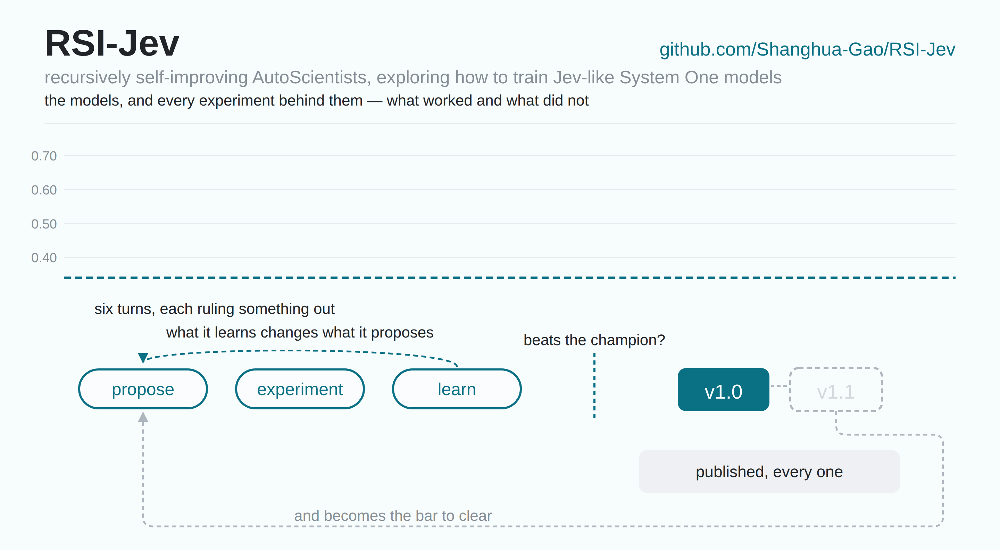

# RSI-Jev

**A recursively self-improving research system that builds
[Jev](https://docs.typesafe.ai/api)-style *System One* models.** AI agents propose the
hypotheses, register their predictions before spending GPU time, run the experiments, and
retire their own champions when the evidence says to.

[](LICENSE)
[](https://huggingface.co/shgao)
[](serve/README.md)
[](versions/v1.0.md)

Ask one of these models a typed question about a document — yes/no, pick-one-of-*k*,
rate-on-a-rubric — and a single forward pass returns a probability for every option instead of
prose. Nothing is generated, so another decision about a document already read costs about
**10 ms**.

The loop running the research is the **next version of
[AutoScientists](https://github.com/mims-harvard/AutoScientists)**.

*Want to collaborate, or support the work with compute or funding? Reach out to
**[Shanghua Gao](https://shgao.site)**.*

## RSI process

<p align="center">
  
</p>

**v1.0** came out of that cycle as a Qwen3.5 Base tower fine-tuned end to end with a trained
cross-attention scorer on top, fitted to a teacher's full probability distribution over 6,977
synthetic documents rather than to its labels.

**Being explored now: reinforcement learning, and the data.** RL runs stably on this base at
last and needs a reward carrying what the supervised target does not; on the data side, a
reasoning teacher that scores 0.677 here looks worth distilling into labels or into that reward.

It took five turns to get there, each one ruling something out, which is how the next one knew
where to go:

| where it went | typed-decisions | what it established |
|---|---|---|
| the frozen base, read out by its own logprobs | 0.3775 | a base model on its own sits below the majority baseline |
| a trained readout head on a frozen tower | 0.4850 | the head is not the bottleneck |
| the same head, trained on synthetic data | 0.483 | neither is the data — the **frozen tower** is |
| fine-tune the tower, 0.8B | 0.6097 | capability is the lever: +0.125 in one step |
| the same recipe at 2B | 0.6598 | scale helps, and surfaces an instability |
| **v1.0** | **0.662** | the instability was **precision, not the optimiser** |

That last line cost seven registered fixes aimed at the optimiser, all of which failed, and is
one line of code.

[`EXPLORE.md`](EXPLORE.md) has every direction and what the territory was like ·
[`versions/v1.0.md`](versions/v1.0.md#10-how-it-got-here) has the trail to v1.0

## RSI-Jev models

| model | typed-decisions | MMLU-Pro 1k | per decision | |
|---|---|---|---|---|
| **RSI-Jev-v1.0-2B** | **0.662** | 0.355 | ~10 ms | [**⬇ Hugging Face**](https://huggingface.co/shgao/rsi-jev-v1.0-qwen3.5-2b) |
| **RSI-Jev-v1.0-0.8B** | 0.614 | 0.269 | ~10 ms | [**⬇ Hugging Face**](https://huggingface.co/shgao/rsi-jev-v1.0-qwen3.5-0.8b) |

Architecture, training recipe and limitations are on each model card.
[`BENCHMARKS.md`](BENCHMARKS.md) is what these numbers mean and how to re-run them;
[`versions/v1.0.md`](versions/v1.0.md) is the full record, every figure with its caveats.

To run them:

```bash
git clone https://github.com/Shanghua-Gao/RSI-Jev && cd RSI-Jev && pip install -r requirements.txt
```

| | | |
|---|---|---|
| **Compare releases** | `python scripts/demo_web.py` | every released version side by side, answers moving as you type |
| **Serve** | `python scripts/serve.py --ckpt DIR` | `POST /v1/systemone`, Jev's own request and answer shapes → [`serve/README.md`](serve/README.md) |
| **Load** | `load_release(path, device="cuda")` | from `scripts/load_release.py`; a published checkpoint carries its own code |
| **Retrain** | `python scripts/release_train.py` | one H100, ~13 min per seed at 2B → [`rsijev/README.md`](rsijev/README.md) |
| **Measure** | `bench.py`, `calibration.py`, `routing.py` | these tables, on your hardware → [`BENCHMARKS.md`](BENCHMARKS.md) |

Runs on an **NVIDIA DGX Spark** (where it is developed), any CUDA GPU, Apple Silicon, or plain
CPU — per-machine costs in [`versions/v1.0.md`](versions/v1.0.md#7-what-it-costs-to-run).

## What the next version is

Not decided yet. That is the invitation.

**Say what is wrong with it. Bluntly.** There is no maintainer here to offend — an AI agent
does not get defensive about a bad review, it registers a prediction and spends GPU time on it.
A case where the model is **confidently wrong** is worth more to this project than any
compliment. A variant you tried that **failed** is worth more than one that worked, because it
deletes a branch nobody has to pay for again.

[**The model got it wrong →**](https://github.com/Shanghua-Gao/RSI-Jev/issues/new?template=wrong-answer.yml) · the document, the question, the answer you expected
[**I tried a variant →**](https://github.com/Shanghua-Gao/RSI-Jev/issues/new?template=experiment.yml) · what you changed, per-seed numbers, which kernel stack

Your report becomes a registered prediction with a null floor measured against it, and ships as
a version — pass or fail. [`CONTRIBUTING.md`](CONTRIBUTING.md) is what happens in between.

## Read more

| | |
|---|---|
| [`versions/`](versions/) | **one record per release, kept** — how it was built, what it scores, what it costs, its limitations. Currently [`v1.0.md`](versions/v1.0.md) |
| [`EXPLORE.md`](EXPLORE.md) | **what the loop tried and rejected** between releases |
| [`BENCHMARKS.md`](BENCHMARKS.md) | **what each number means** and how to reproduce it |
| [`CONTRIBUTING.md`](CONTRIBUTING.md) | **what to send and what happens to it** |
| [`serve/README.md`](serve/README.md) | **the HTTP API** — copied from Jev exactly, except where stated |
| [`rsijev/README.md`](rsijev/README.md) | **the code** — and which files the loop may rewrite |

## Acknowledgements

Thanks to **NVIDIA** for providing the **DGX Spark** used for inference testing.

## License

Code MIT. Checkpoints follow their base model's license (Apache-2.0). Not affiliated with
TypeSafe AI.
