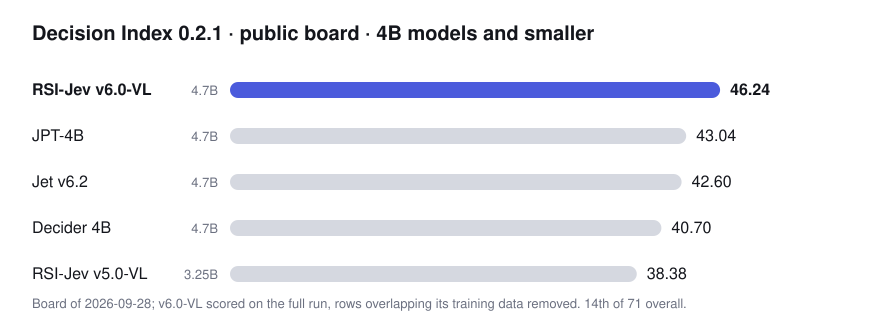
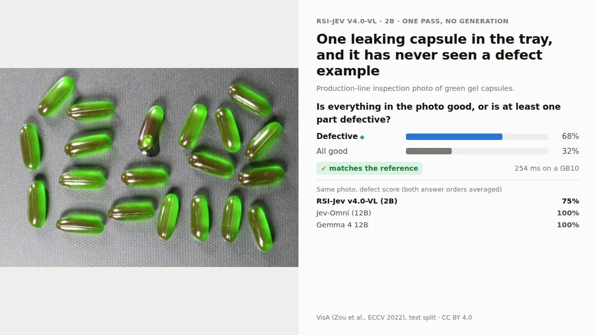
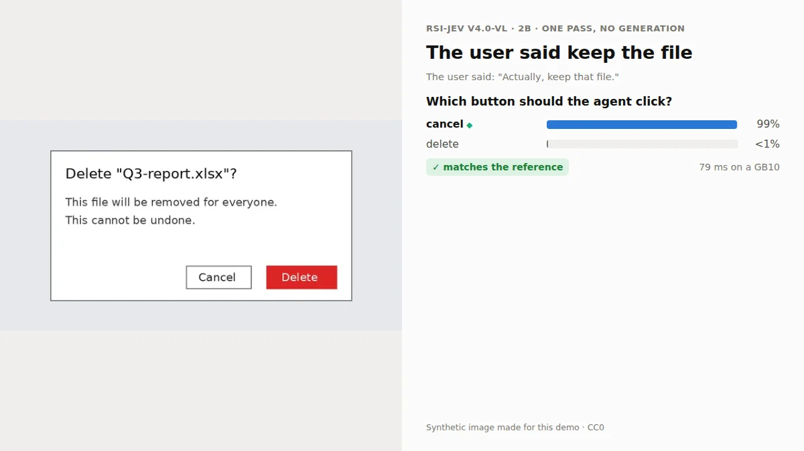
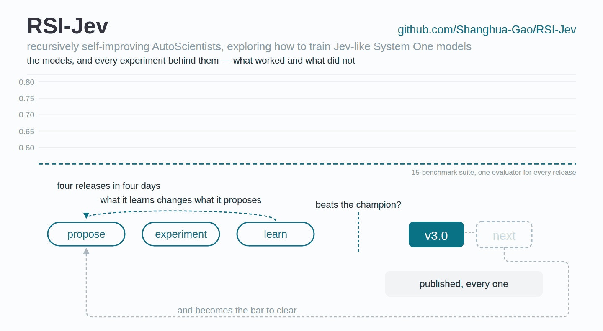

<h1 align="center">RSI-Jev</h1>

<p align="center">
<b>A recursively self-improving research loop that builds
<a href="https://docs.typesafe.ai/api">Jev</a>-style <i>System One</i> decision models.</b>
</p>

<p align="center">
  <a href="https://huggingface.co/shgao">🤗 Models</a> ·
  <a href="https://shanghua-gao.github.io/RSI-Jev/">Demos</a> ·
  <a href="docs/inference.md">Docs</a> ·
  <a href="EXPLORE.md">Every experiment</a> ·
  <a href="versions/v6.0-vl.md">Release notes</a>
</p>

<p align="center">
  <a href="LICENSE"></a>
  <a href="https://huggingface.co/shgao/rsi-jev-v6.0-vl-4b"></a>
  <a href="serve/README.md"></a>
</p>

AI agents propose the hypotheses, register their predictions before spending GPU time, run the
experiments, and retire their own champions when the evidence says to. Every release, and every
experiment that failed on the way, is published with its numbers. The loop is the next version of
[AutoScientists](https://github.com/mims-harvard/AutoScientists).

- **7 releases in 12 days**, from v1.0 to v6.0-VL, each trained, evaluated and documented by the loop.
- **471 experiments**, every one written up, failures included: [EXPLORE.md](EXPLORE.md).
- **v6.0-VL 4B scores 46.24 on the public Decision Index**, the best 4B model on the board.

<p align="center">
  <picture>
    <source media="(prefers-color-scheme: dark)" srcset="assets/board-v6-dark.svg">
    
  </picture>
</p>

## What it builds

Models that answer a yes/no, pick-one-of-*k* or rate-on-a-rubric question about a document, a chat
or an image. One forward pass returns a calibrated probability for every option. Nothing is
generated, so there are no reasoning tokens to spend.

What v6.0-VL can spend is depth. It has answer heads at layers 16, 20 and 32, and `effort` picks
how many layers a request uses:

| effort | layers | median latency | use it for |
|---|---|---|---|
| `low` | 16 | 23 ms | intent, routing, retrieval: layer 16 is already as good as 32 |
| `medium` | 20 | 27 ms | classification and judgement |
| `high` | 32 | 40 ms | knowledge, multi-step reasoning, code |
| `auto` | 16, 20 or 32 | – | mixed traffic: stops at the first layer that is confident enough |

Fast when it's easy, deep when it's hard. Which tasks need which depth:
[docs/effort-depth.md](docs/effort-depth.md).

<p align="center">
  <picture><source media="(prefers-color-scheme: dark)" srcset="site/assets/v4/capsules-dark.webp"></picture>
  <picture><source media="(prefers-color-scheme: dark)" srcset="site/assets/v4/keep-file-dark.webp"></picture>
  <br><sub>Capsules photo from VisA (Zou et al. 2022, CC BY 4.0, resized).</sub>
</p>

## Quickstart

```bash
pip install "rsi-jev[fast,vision] @ git+https://github.com/Shanghua-Gao/RSI-Jev"
rsi-jev serve v6.0-vl-4b --effort auto --port 8000
```

```bash
curl localhost:8000/v1/systemone -H 'Content-Type: application/json' -d '{
  "model": "jev-latest",
  "state": "I was charged twice. Please refund.",
  "questions": {"refund": {"type": "noul", "instructions": "Does the user request a refund?"}}
}'
```

Or in Python, with no server:

```python
from rsijev import Decider

d = Decider("v6.0-vl-4b")
d.decide("Customer photo: <image>\nThe customer says it arrived damaged.",
         {"damaged": {"type": "noul", "instructions": "Does the photo show visible damage?"}},
         images=["photo.jpg"])
```

The server speaks Jev's API, so an existing Jev client works once its base URL points here. Every
response reports which layer answered and how confident it was. Options and limits:
[`serve/README.md`](serve/README.md); setups and what each costs: [`docs/inference.md`](docs/inference.md).

## Releases

| Model | Input | Decision Index | Held-out set | |
|---|---|---|---|---|
| **v6.0-VL-4B** | text, images | **46.24** | **0.698** | [🤗](https://huggingface.co/shgao/rsi-jev-v6.0-vl-4b) |
| v5.0-VL-3B | text, images | 38.38 | 0.689 | [🤗](https://huggingface.co/shgao/rsi-jev-v5.0-vl-3b) |
| v4.0-VL-2B | text, images | – | 0.653 | [🤗](https://huggingface.co/shgao/rsi-jev-v4.0-vl-qwen3.5-2b) |
| v3.0-2B | text | – | 0.649 | [🤗](https://huggingface.co/shgao/rsi-jev-v3.0-qwen3.5-2b) |
| v2.1-2B | text | – | 0.633 | [🤗](https://huggingface.co/shgao/rsi-jev-v2.1-qwen3.5-2b) |
| v2.0-2B | text | – | – | [🤗](https://huggingface.co/shgao/rsi-jev-v2.0-qwen3.5-2b) |
| v1.0-2B | text | – | 0.604 | [🤗](https://huggingface.co/shgao/rsi-jev-v1.0-qwen3.5-2b) |
| v1.0-0.8B | text | – | – | [🤗](https://huggingface.co/shgao/rsi-jev-v1.0-qwen3.5-0.8b) |

Decision Index 0.2.1 is the public benchmark, full run. The held-out set is our zero-shot check: no
release trained on it. All are fine-tuned from Qwen3.5 Base; v6.0-VL runs the whole Qwen3.5-4B-Base
and can answer at layer 16, 20 or 32 of it. Every number, caveat and per-benchmark score is in the
[release records](versions/).

- **2026-10-06 · v6.0-VL 4B** chooses its depth per question. Decision Index 38.38 → 46.24.
- **2026-10-02 · v5.0-VL 3B** cuts the model to the first 20 of 32 layers and says "unknown" when a question has no answer.
- **2026-10-01 · v4.0-VL** reads images, with text held at v3.0's level.
- **2026-09-28 · v3.0** is the first release where reinforcement learning helps.

## How it got here

<p align="center">
  
  <br><sub>The loop's first three releases: each grey dot is an experiment that did not beat the champion.</sub>
</p>

The experiments that made a release are in [docs/history.md](docs/history.md); all the others,
with why each failed, are in [EXPLORE.md](EXPLORE.md); the reinforcement-learning arms are in
[docs/rl.md](docs/rl.md).

<details>
<summary><b>Each experiment that moved a release, from v1.0 to v6.0-VL</b></summary>

| where it went | result | what it established |
|---|---|---|
| **v1.0** | typed-decisions **0.662** | the bar to clear, and it had never seen a benchmark's train split |
| train on the benchmark's own train split | typed-decisions 0.7794 | worth +0.12 — and it costs general knowledge, so it was **rejected** |
| the same + 15% general-knowledge replay | typed-decisions 0.796 | the replay pays that cost back. The first keeper |
| the other benchmarks' train splits too, 3k per source | suite 0.7049 | the lever is not specific to one benchmark |
| a per-question confidence head, forbidden to sharpen score questions | suite ECE 0.0736 | confidence that means something, and it never changes which option wins. Shipped |
| **v2.0** | suite **0.7056**, ECE **0.0546** | capability was v1.0's lever; **what it trains on, and calibrating it afterwards, is a second one** — and free at inference. But the gain was on the benchmarks it had trained for |
| the replay weighted toward science, half of it recast to ten options | MMLU-Pro 0.331 | more and better-shaped data barely moves general knowledge: +0.008 |
| **freeze** the tower's lower third instead | MMLU-Pro 0.339 | holding those layers still does recover some of it — and breaks three of the decision benchmarks, because they do need to adapt |
| the bottom 8 layers at **one tenth** the learning rate | MMLU-Pro 0.359 | it was never a data problem. Fitting decisions through the whole tower at one rate was overwriting what the knowledge sat in — frozen layers cannot adapt, slow ones can |
| **v2.1** | suite **0.7291**, MMLU-Pro **0.383** | and it travels: ahead of v1.0 on all three benchmarks it never trained on, where v2.0 was not |
| wider coverage (data-scale-2): +84k questions, emotion/SST-5/ANLI and more tasksource and Open-Jev train items | suite +0.011 / +0.013 on two seeds | coverage is still the lever that moves the suite |
| a two-layer MLP combining the option and cross-attention features | suite 0.7589 on the new 15-benchmark suite | the readout had a little left in it: +0.002 |
| a listwise reranking reward (NDCG@5 over 16 candidates) on top, against a KL anchor | hippo R@1 0.192 → 0.308, suite −0.003 | **the first RL stage kept**: a reward over the *order* of candidates carries what per-item labels cannot |
| **v3.0** | suite **0.756**, ECE **0.066** | **the first release where RL works**: +60% reranking R@1 over its supervised parent, the rest held level |
| image training on the train splits of twelve public datasets, with text replay | held-out image top-1 0.809 against 0.796 for a text-only control | the model reads images through the base model's frozen vision tower |
| generated reasoning questions with soft targets where the model is at chance | held-out ECE after calibration, BBH excluded, 0.096 → 0.075 | the image rounds had made it overconfident; this repairs most of it |
| an RL stage charging a confident mistake 4x a timid correct answer | held-out ECE before calibration 0.200 → 0.082 | against a matched supervised stage: better accuracy and calibration, no detectable ranking difference (one seed) |
| **v4.0-VL** | image top-1 **0.803** held out, suite **0.756**, ECE **0.043** | **reads images**, with text held at v3.0's level |
| the same recipe on Qwen3.5-4B, read at layer 16, 20 or 24 of its 32 | suite 0.744 · 0.760 · 0.760 | a System One model doesn't need the deep layers: quality flattens by layer 20 |
| images on the layer-20 model, plus questions whose right answer is "unknown" | KoBBQ unknown-when-ambiguous 0.679 → 0.891 | images cost the model its "unknown" answer until the data asked for it |
| pool each option over its own tokens, not the separator that follows the previous one | CLINC150 0.383 → 0.753 | a readout bug found by an outside benchmark; the same weights read correctly once each option is pooled over its own tokens |
| retrain only the decision head for that readout, tower frozen, 600 steps | final ECE after calibration 0.080 → 0.042, Decision Index 38.38 | the head had learned the old pooling; a short head-only stage recovers the calibration |
| **v5.0-VL** | MMLU-Pro **0.429**, Decision Index **38.38**, KoBBQ unknown **0.932** | **3B: the first 20 of 32 layers** |
| early-exit heads that read a detached copy of their layer, so no gradient from them reaches the trunk | MMLU-Pro 0.443 at layer 32 | retuning heads on a trunk trained with attached exits had not recovered depth: the trunk had lost it |
| 10,000 steps on a cleaned corpus instead of 40,000 on the old one | held-out +0.026, MMLU-Pro +0.043 | longer training overfits the suite; shorter and cleaner wins held out |
| one temperature per exit and an exit policy fitted on held-out proxies of the test mix | every release bar passes at 20.9 layers on average | policies tuned on in-distribution rows stop too early on hard questions |
| **v6.0-VL** | Decision Index **46.24**, MMLU-Pro **0.440** | **4B: answers at layer 16, 20 or 32, whichever is confident first** |

</details>

## Documentation

| | |
|---|---|
| [Inference guide](docs/inference.md) | setups, measured latency, speed-ups |
| [Effort and depth](docs/effort-depth.md) | which tasks and questions need the deep layers |
| [HTTP API](serve/README.md) | the Jev-compatible server |
| [Benchmarks](BENCHMARKS.md) | what each number means and how to reproduce it |
| [Release records](versions/) | how each release was built, what it scores, its limitations |
| [Reinforcement learning](docs/rl.md) | where RL beat supervised training, and where it didn't |
| [Speed](docs/speed.md) | how inference was made faster |
| [Code](rsijev/README.md) | training and the files the loop may rewrite |

## Contributing

A case where the model is confidently wrong, or a variant you tried that failed, is the most useful
thing you can send: [report a wrong answer](https://github.com/Shanghua-Gao/RSI-Jev/issues/new?template=wrong-answer.yml)
· [report an experiment](https://github.com/Shanghua-Gao/RSI-Jev/issues/new?template=experiment.yml).
Each becomes a registered prediction tested in the next version. See
[`CONTRIBUTING.md`](CONTRIBUTING.md). To collaborate or support the work with compute,
contact [Shanghua Gao](https://shgao.site).

## Acknowledgements

Thanks to **HP** and **NVIDIA** for providing the **HP ZGX Nano AI Station**, powered by the
**NVIDIA GB10 Grace Blackwell Superchip**.

## License

Code: MIT. Weights: Apache-2.0, following the base model; some image training sources are
non-commercial, listed on each model card. Not affiliated with TypeSafe AI. To cite, use
[`CITATION.cff`](CITATION.cff).
