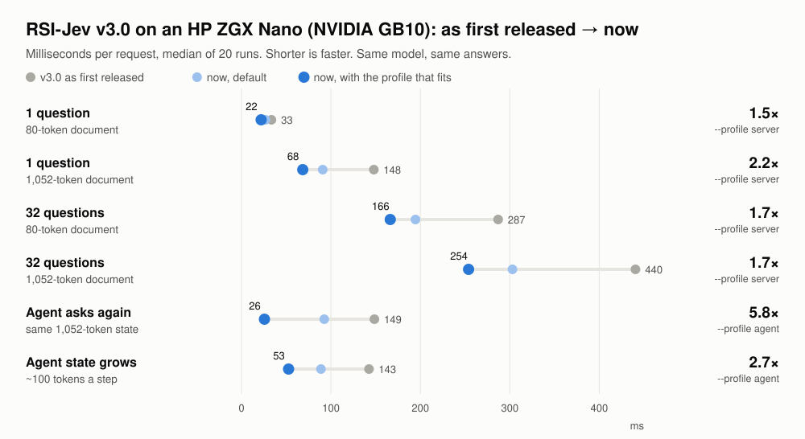
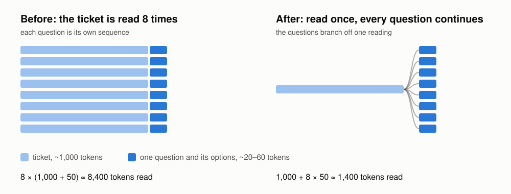

# Making a decision model fast on a desktop GPU

*RSI-Jev v3.0 · measured on an HP ZGX Nano (NVIDIA GB10)*

RSI-Jev is an open, Jev-style decision model. You give it some text and a few questions, each
with the answers you allow, and it returns a probability for every answer instead of writing a
reply. It runs on your own machine, and it usually sits inside something that is waiting for it:
a support queue, a moderation pipeline, an agent deciding its next step.

So we gave the next generation of [AutoScientists](https://github.com/mims-harvard/AutoScientists),
our AI research-agent system, one question: how fast can the released v3.0 model answer on a
desk-side GPU, without changing a single answer? The agents measured where the time went,
proposed changes, tested each one against the unchanged model, and kept only those that passed.
Out of the box it is now **1.3–1.6x faster**. A
long-running server gets **up to 2.2x** with one flag, and an agent that keeps asking about the
same conversation gets **up to 5.8x**.

If some answers are allowed to change, it goes further. These are the fastest versions we found,
all measured in one session:

| | 1 question, short document | 1 question, 1,000-token document | 32 questions on it | answers that change* |
|---|---|---|---|---|
| v3.0 as first released | 35 ms | 148 ms | 443 ms | — |
| now, same answers (`--profile server`) | 24 ms | 69 ms | 255 ms | none |
| FP8 weights + compile | 22 ms | **57 ms** | **233 ms** | 3–8% |
| 4-bit weights on vLLM | **17 ms** | 88 ms | 2,234 ms | 3–23% |

*Share of answers that differ from the unchanged model: the low end on our typed-decision test, the high end on MMLU-Pro.*

Giving up exactness buys 1.1–1.4x over the lossless version. 4-bit on vLLM is the fastest for one
short question and far slower for many questions on one document.

<picture>
  <source media="(prefers-color-scheme: dark)" srcset="assets/speed_gb10_dark.svg">
  
</picture>

Most of this comes from one observation about how these models spend their time.

## The document is the expensive part

Take a support ticket of about 1,000 tokens, and eight questions about it: which team should
handle it, is it a refund request, how urgent is it, and so on. Each question with its options
is 20–60 tokens.

The straightforward way to answer is to give the model the ticket plus one question, eight times
over. That reads the ticket eight times. But the model reads left to right, so its work on the
ticket is identical for every question that follows. It can read the ticket once, keep what it
computed, and continue each question from there. The answers come out exactly the same.

<picture>
  <source media="(prefers-color-scheme: dark)" srcset="assets/read_once_dark.svg">
  
</picture>

On the GB10, the eight questions take **1,347 ms** when the ticket is read eight times and
**253 ms** when it is read once, 5.3x less. With sixteen questions the gap is 8.8x. A request
costs roughly one reading of the document, plus a little for each question. The practical
advice follows directly: **ask all your questions about a document in one request.**

RSI-Jev's server already did this in v3.0. What the agents found was that it often was not doing
it on this machine, and that agents were paying for the document again on every call.

## A setting tuned on one GPU was switching it off on another

Reading once has a small fixed cost: a second pass, and a copy of the kept state for each
question. For a short document with only two or three questions, that overhead is bigger than
the saving. So the server only reads once when enough work is saved, and the cut-off had been
measured on an A100.

An A100 is fast enough per pass that the saving must be large to pay off. The GB10 is not, and
its break-even point is about four times lower:

| tokens saved by reading once | 280 | 400 | 480 | 1,200 | 2,800 |
|---|---|---|---|---|---|
| speed-up on the GB10 | 0.75x | 1.06x | 1.28x | 1.97x | 3.84x |

With the A100's cut-off, the GB10 was reading documents repeatedly on every request in that
middle range and losing 1.3–2x. The server now chooses the cut-off by GPU. A number that trades
a fixed cost against saved work belongs to the hardware, not to the model.

## Agents ask about the same thing again and again

An agent calls the model at every step with its whole conversation so far, and each call usually
adds only a few lines. Reading once within a request does not help there: every call starts
from scratch.

`--profile agent` keeps what the model computed for a document across requests. A repeated
document skips the reading entirely, and a document that has grown only reads the new part.
Two details keep it exact. Entries are keyed on the exact tokens and the model weights, never on
the raw text. And the last few tokens are always re-read, because adding text can change how
the old ending splits into tokens (a JSON transcript's closing `}]` turning into `},{` is the
usual case).

On a 1,000-token conversation, asking again drops from **149 ms to 26 ms**. A conversation that
grows by about 100 tokens per step drops from 143 ms to **53 ms** per step. Every answer matches
a fresh reading.

## The smaller wins: make sure the fast code runs

Three quarters of the model's layers are a newer kind of attention (Gated DeltaNet), and their
fast implementation ships as a separate package. Without it, the model silently falls back to
a slow reference version, and the only sign is one line in a log. Installing it made everything
**1.25–1.63x** faster, with results identical to the training run's own records. It is now part
of `pip install "rsi-jev[fast]"`, and the server prints at startup which kernels it is using.

For a server that runs for hours, `--profile server` also compiles the model (about 40 s at
startup), for another **1.1–1.3x**.

## Everything around the model

Once the model itself was fast, the agents profiled a request from socket to socket. The model's
forward pass was 85–97% of the time, but the rest had one surprise: the server tokenized the
document once for every question, and once more to check whether the questions shared it. With
32 questions on a 1,000-token document that was 29 ms, 10% of the request. It now tokenizes the
document once. The same pass cut the copies back from the GPU, moved request parsing off the
model's thread, and added a faster JSON encoder. Every one of 12,389 test answers is
bit-identical, and the 32-question request drops from 309 to 277 ms. There is nothing to turn on.

**Many clients at once.** The server answered one request at a time, so 32 clients each asking
one short question got the same 32 requests per second as one client did. `--batch-window-ms 0`
lets the questions that are waiting at the same moment share one forward pass: **32 → 72
requests per second**, and the median wait at 32 clients falls from 984 to about 400 ms. vLLM
reaches 84 on this workload, and is still ahead on single questions about long documents; on
several questions per document, this server does 2.5x more than vLLM. It is opt-in because a
question's probabilities move very slightly with what it shares a pass with (99% of answers
unchanged on the knowledge test, calibration within 0.002).

**Less padding.** The questions in one pass are padded to the longest one, and every question to
160 answer slots. A request that mixes yes/no questions with long lists of options wasted most
of its work. `RSIJEV_SORT_ROWS=1 RSIJEV_TRIM_OPTIONS=1` groups questions of similar length and
trims the unused slots: **1.7–1.8x** on such a request, and 1.08–1.13x on uniform ones, with
every top answer unchanged.

## What did not help, and why

A single pass has a floor on this machine. The model's weights are 2.75 GB, and the GB10 reads
memory at about 273 GB/s, so one pass cannot take less than about 10 ms; one question measures
22–27 ms. When many questions are answered together, the weights are read once for all of them
and the GPU spends its time computing. Tricks aimed at other bottlenecks had little to work with:

| tried | what happened |
|---|---|
| 4-bit and 8-bit weights | faster only for a single short question (28 → 19 ms with 4-bit), and they changed answers: 4-bit agreed with the full model on only 69–77% of MMLU-Pro questions |
| FP8 | slower without compiling, and changed 3–8% of answers |
| a faster kernel for the DeltaNet layers (FlashQLA) | 2–2.7x faster on its own, but those layers take about 9% of the time: 1–13% overall |
| CUDA graphs | slower: they remove launch overhead, and the GPU was already busy computing |
| vLLM | built for generating text; on this model it keeps shared documents in 544-token blocks, so short documents are re-read for every question. It did handle many concurrent single questions more than twice as fast; micro-batching (above) closed most of that gap |

The agents held every change to one rule: **a faster answer must be the same answer.** People set
thresholds on these probabilities, so a speed-up that moves them is a regression. Each change was
compared with the unchanged model on the release's verification sets, on 200 questions from the
training run's own records, and on calibration error. Quantization failed that test, and it
failed first on knowledge-heavy questions.

## Try it

```bash
pip install "rsi-jev[fast] @ git+https://github.com/Shanghua-Gao/RSI-Jev"
rsi-jev serve shgao/rsi-jev-v3.0-qwen3.5-2b                    # default
rsi-jev serve shgao/rsi-jev-v3.0-qwen3.5-2b --profile agent    # agents re-asking about a conversation
rsi-jev serve shgao/rsi-jev-v3.0-qwen3.5-2b --profile server   # long-running servers
rsi-jev serve shgao/rsi-jev-v3.0-qwen3.5-2b --batch-window-ms 0 # many clients, short questions
```

It speaks Jev's API, so an existing Jev client only needs its base URL changed.
[`inference.md`](inference.md) has the details.

## What comes next

What is left sits almost entirely inside the model's forward pass. Next on the agents' list,
each held to the same rule:

- **Images read once.** The next release reads images. Today each question about an image
  re-reads it; reading it once and branching every question off it is the same trick as above.
- **Sharing a document's reading across clients.** Micro-batching pools single questions; pooling
  the document pass of multi-question requests would extend it to them.
- **CUDA graphs on datacenter GPUs.** They did not help on the GB10, but on an H100 one question
  drops to 12.1 ms in our tests.

*Measured on an HP ZGX Nano AI Station with the NVIDIA GB10 Grace Blackwell Superchip, provided by
HP and NVIDIA. Medians of 20 runs, one configuration per process, bf16 model; raw data in
[`assets/bench_gb10.json`](assets/bench_gb10.json) and, for the fastest-versions table,
[`assets/bench_fastest_gb10.json`](assets/bench_fastest_gb10.json).*
